# A-Team

A Team Designer agent system running on Claude Code. Through in-depth dialogue to clarify your requirements, automatically generates complete multi-agent team structures (agents / skills / rules) that support both subagent and Agent Teams deployment modes.

一組運行在 Claude Code 上的團隊設計師 agent 系統。透過深度對話釐清你的需求，自動產出完整的 multi-agent 團隊結構（agents / skills / rules），支援 subagent 與 Agent Teams 兩種部署模式。

---

## English 

### Problem Statement

You know agents work better with proper division of labor, but manually planning roles and writing individual .md files is time-consuming and error-prone. A-Team transforms "team design" itself into a conversational, automatable process.

A-Team is **not** an Agent Team itself — it is a **tool for designing** agent teams. It generates team structures that can be deployed as either subagents (Task tool) or full Agent Teams (experimental).

### Quick Start

1. Copy this folder's contents to your project's `.claude/` directory
2. Launch the `team-architect` agent in Claude Code
3. Tell it what team you want to build, e.g., "I want to build a content production team for an online English teaching company"
4. Follow the interview, answer questions
5. When complete, the generated team structure appears in `teams/{team-name}/` directory

### System Architecture

```
.claude/
├── agents/
│   ├── team-architect.md            ← Chief coordinator, leads entire process
│   │
│   ├── discovery/                   ← Phase 1: Discovery
│   │   ├── requirements-analyst.md  ← In-depth interviews, extract requirements
│   │   └── role-designer.md         ← Responsibility decomposition, define roles
│   │
│   ├── planning/                    ← Phase 2: Planning
│   │   └── skill-planner.md         ← Plan skills and rules
│   │
│   ├── generation/                  ← Phase 3: Generation
│   │   ├── agent-writer.md          ← Write agent .md files
│   │   ├── skill-writer.md          ← Write skill .md files
│   │   └── rule-writer.md           ← Write rule .md files
│   │
│   └── optimization/                ← Phase 4: Optimization
│       └── prompt-optimizer.md      ← Review and optimize all .md prompts
│
├── skills/
│   ├── structured-interview/        ← Structured interview methodology
│   │   └── SKILL.md
│   ├── role-decomposition/          ← Responsibility decomposition framework (MECE)
│   │   └── SKILL.md
│   ├── granularity-calibration/     ← Granularity calibration
│   │   └── SKILL.md
│   ├── team-topology-analysis/      ← Team topology analysis
│   │   └── SKILL.md
│   ├── md-generation-standard/      ← .md file format specifications
│   │   └── SKILL.md
│   ├── quality-validation/          ← Output quality validation
│   │   └── SKILL.md
│   └── prompt-optimization/         ← Prompt optimization methodology
│       └── SKILL.md
│
└── rules/
    ├── coordinator-mandate.md       ← Every team must have a coordinator
    ├── output-structure.md          ← Output directory structure specification
    ├── conversation-protocol.md     ← Conversation flow protocol
    ├── writing-quality-standard.md  ← .md writing quality specification
    └── yaml-frontmatter.md          ← YAML frontmatter requirements
```

### Workflow

```mermaid
flowchart LR
 subgraph P1["Phase 1: Discovery"]
    direction TB
        RA["requirements-analyst <br> Interviews"]
        RD["role-designer <br> Role design"]
  end
 subgraph P2["Phase 2: Planning"]
        SP["skill-planner <br> Skill plan"]
  end
 subgraph P3["Phase 3: Generation"]
    direction TB
        RW["rule-writer"]
        SW["skill-writer"]
        AW["agent-writer"]
  end
 subgraph P4["Phase 4: Optimization"]
        PO["prompt-optimizer <br> Prompt optimize"]
  end
 subgraph DIR["teams/name/"]
    direction TB
        claude_md["CLAUDE.md"]
        agents["agents/"]
        skills["skills/"]
        rules["rules/"]
  end
    TA(["team-architect <br> Chief coordinator, spans entire process"]) -.-> P1
    P1 --> P2
    P2 --> P3
    P3 --> P4
    P4 --> RD_OUT{"Review & Deliver"}
    TA ----> RD_OUT
    RD_OUT --> DIR
```



### Output Example: Requirements Documentation Team

A real team generated by A-Team: [`teams/requirements-docs/`](teams/requirements-docs/) — a requirements documentation team that transforms vague PM/client requirements into complete development documents (PRD, SA, SD, Test Cases) with PM confirmation gates, JIRA integration, and company-level glossary management.

**7 Agents | 9 Skills | 5 Rules**

```
teams/requirements-docs/
├── CLAUDE.md                                    ← Team-wide instructions
└── .claude/
    ├── agents/
    │   ├── coordinator.md                       ← Workflow orchestration, PM confirmation cycles, JIRA triggers
    │   ├── knowledge/
    │   │   └── knowledge-curator.md             ← Company glossary & cross-project references
    │   ├── requirements/
    │   │   └── requirements-analyst.md          ← Interviews, requirements summary/draft, PRD (with UI/UX)
    │   ├── architecture/
    │   │   └── system-architect.md              ← SA & SD documents
    │   ├── testing/
    │   │   └── test-case-designer.md            ← Test cases with full traceability
    │   └── review/
    │       ├── document-reviewer.md             ← Document quality gate (5 dimensions)
    │       └── process-reviewer.md              ← Team collaboration retrospective
    ├── skills/
    │   ├── interview-technique/SKILL.md         ← Structured interview methodology
    │   ├── prd-template/SKILL.md                ← PRD template (Confluence format)
    │   ├── sa-template/SKILL.md                 ← SA template
    │   ├── sd-template/SKILL.md                 ← SD template (with API specs)
    │   ├── test-case-template/SKILL.md          ← Test case template
    │   ├── document-review-checklist/SKILL.md   ← Review checklist (5 dimensions)
    │   ├── glossary-management/SKILL.md         ← Company glossary maintenance
    │   ├── jira-operation/SKILL.md              ← JIRA ticket creation specs
    │   └── process-retrospective/SKILL.md       ← Process review framework
    └── rules/
        ├── pm-confirmation-gate.md              ← PM must confirm before next phase
        ├── document-format-standard.md          ← Confluence format requirements
        ├── writing-style.md                     ← Writing style standards
        ├── jira-sync-timing.md                  ← JIRA operation timing rules
        └── cross-project-consistency.md         ← Cross-project glossary enforcement
```

**Workflow:**

```
⓪ Knowledge Curator prepares background pack (glossary + cross-project refs)
① Interview → ② Requirements Summary → ③ Requirements Draft → ④ Full PRD
⑤ SA → ⑥ SD → ⑦ Test Cases → ⑧ Glossary Update → ⑨ Process Review

Each phase: Executor → Document Reviewer → PM Confirmation → Next Phase
JIRA: PRD→Epic+Stories | SA→Update Stories | SD→Sub-tasks | TC→Test Sub-tasks
```

### Deployment Modes

A-Team generates teams that support two deployment modes:

**Subagent Mode (Default)** — Agents are invoked via the Task tool within a single Claude Code session. The coordinator manages all delegation. Best for sequential workflows with clear handoffs. Works out of the box.

**Agent Teams Mode (Experimental)** — Agents run as independent Claude Code instances with shared task lists and peer-to-peer messaging. Best for parallel workflows where agents need direct communication. Requires enabling:

```json
// settings.json
{
  "env": {
    "CLAUDE_CODE_EXPERIMENTAL_AGENT_TEAMS": "1"
  }
}
```

Reference: https://code.claude.com/docs/en/agent-teams

### Design Principles

**Coordinator Mandate** — Every team must have a coordinator responsible for task planning and assignment. Coordinators do not perform execution work. Flat architecture only — no sub-coordinators.

**Parallelism-Aware Design** — During requirements exploration, A-Team identifies which tasks can run in parallel and designs communication patterns (peer-to-peer messaging, broadcast) for Agent Teams deployment.

**Focus on Generation Quality** — The three writers in the generation phase each handle only one file type (agent / skill / rule), ensuring each .md is written with full attention.

**Prompt Optimization** — After all .md files are generated, the prompt-optimizer reviews and optimizes them, improving instruction quality while preserving original characteristics, eliminating vague expressions, and enhancing actionability.

**Depth-First Dialogue** — Requirements exploration is not skipped. Even if you have clear ideas, A-Team still validates assumptions and uncovers blind spots through interviews.

**CLAUDE.md as Team Contract** — Every generated team includes a `CLAUDE.md` containing team-wide instructions that all agents must follow. Role-specific rules go in `rules/`.

**Multi-Language Support** — All agents communicate in the user's language. Write in English, get responses in English. Write in Traditional Chinese, get responses in Traditional Chinese.

### Customization and Extension

A-Team produces an initial framework. You can:

- Directly modify any .md file's prompt content
- Add or remove roles
- Adjust skill and rule details
- Copy the generated `teams/{name}/` folder to your actual project root for use

---

## 繁體中文

### 解決什麼問題

你知道 agent 要適度分工效果才好，但每次手動規劃角色、逐一撰寫 .md 檔案既耗時又容易遺漏。A-Team 把「團隊設計」這件事本身變成一個可對話、可自動化的流程。

A-Team **不是** Agent Team 本身——它是一個**設計 Agent Team 的工具**。它產出的團隊結構可以用 subagent（Task tool）或完整的 Agent Teams（實驗性功能）兩種模式部署。

### 快速開始

1. 將本資料夾內容複製到你的專案 `.claude/` 目錄下
2. 在 Claude Code 中啟動 `team-architect` agent
3. 告訴它你想建什麼團隊，例如：「我想幫一個線上英語教學公司建立教材製作團隊」
4. 跟著它的訪談走，回答問題即可
5. 完成後，產出的團隊結構會出現在 `teams/{team-name}/` 目錄下

### 系統架構

```
.claude/
├── agents/
│   ├── team-architect.md            ← 總調度者，主導全流程
│   │
│   ├── discovery/                   ← Phase 1: 需求探索
│   │   ├── requirements-analyst.md  ← 深度訪談，挖掘需求
│   │   └── role-designer.md         ← 職責拆分，定義角色
│   │
│   ├── planning/                    ← Phase 2: 技能規劃
│   │   └── skill-planner.md         ← 規劃 skills 與 rules
│   │
│   ├── generation/                  ← Phase 3: 結構生成
│   │   ├── agent-writer.md          ← 專寫 agent .md
│   │   ├── skill-writer.md          ← 專寫 skill .md
│   │   └── rule-writer.md           ← 專寫 rule .md
│   │
│   └── optimization/                ← Phase 4: Prompt 優化
│       └── prompt-optimizer.md      ← 審視並優化所有 .md 的 prompt
│
├── skills/
│   ├── structured-interview/        ← 結構化訪談方法論
│   │   └── SKILL.md
│   ├── role-decomposition/          ← 職責拆解框架（MECE）
│   │   └── SKILL.md
│   ├── granularity-calibration/     ← 顆粒度校準
│   │   └── SKILL.md
│   ├── team-topology-analysis/      ← 團隊拓撲分析
│   │   └── SKILL.md
│   ├── md-generation-standard/      ← .md 檔案格式規範
│   │   └── SKILL.md
│   ├── quality-validation/          ← 產出品質驗證
│   │   └── SKILL.md
│   └── prompt-optimization/         ← Prompt 優化方法論
│       └── SKILL.md
│
└── rules/
    ├── coordinator-mandate.md       ← 每個團隊必須有調度者
    ├── output-structure.md          ← 產出目錄結構規範
    ├── conversation-protocol.md     ← 對話流程規範
    ├── writing-quality-standard.md  ← .md 撰寫品質規範
    └── yaml-frontmatter.md          ← YAML frontmatter 規範
```

### 工作流程

```mermaid
flowchart LR
    %% 總架構師
    TA([團隊架構師 <br/> 首席協調員，橫跨整個流程])

    %% 第一階段
    subgraph P1 [第一階段：需求探索]
        direction TB
        RA[需求分析師 <br/> 訪談]
        RD[角色設計師 <br/> 角色設計]
    end

    %% 第二階段
    subgraph P2 [第二階段：規劃]
        SP[技能規劃師 <br/> 技能方案]
    end

    %% 第三階段
    subgraph P3 [第三階段：生成]
        direction TB
        RW[規則撰寫員]
        SW[技能撰寫員]
        AW[代理人撰寫員]
    end

    %% 第四階段
    subgraph P4 [第四階段：優化]
        PO[提示詞優化師 <br/> 提示詞優化]
    end

    %% 最後交付
    RD_OUT{審查與交付}

    subgraph DIR [teams/名稱/]
        direction TB
        claude_md[CLAUDE.md]
        agents[agents/ 代理人]
        skills[skills/ 技能]
        rules[rules/ 規則]
    end

    %% 連線邏輯
    TA -.-> P1
    P1 --> P2
    P2 --> P3
    P3 --> P4
    P4 --> RD_OUT
    TA ----> RD_OUT
    RD_OUT --> DIR
```



### 產出範例：需求文件團隊

由 A-Team 實際產出的團隊：[`teams/requirements-docs/`](teams/requirements-docs/) — 一個需求文件團隊，將 PM/客戶的模糊需求轉化為完整開發文件（PRD、SA、SD、Test Cases），具備 PM 確認閘門、JIRA 整合、公司級 Glossary 管理。

**7 個角色 | 9 個技能 | 5 條規則**

```
teams/requirements-docs/
├── CLAUDE.md                                    ← 團隊通用指引
└── .claude/
    ├── agents/
    │   ├── coordinator.md                       ← 流程管理、PM 確認循環、JIRA 觸發
    │   ├── knowledge/
    │   │   └── knowledge-curator.md             ← 公司 Glossary 與跨專案參照
    │   ├── requirements/
    │   │   └── requirements-analyst.md          ← 訪談、需求摘要/草稿、PRD（含 UI/UX）
    │   ├── architecture/
    │   │   └── system-architect.md              ← SA 與 SD 文件
    │   ├── testing/
    │   │   └── test-case-designer.md            ← 測試案例（完整可追溯）
    │   └── review/
    │       ├── document-reviewer.md             ← 文件品質閘門（5 維審查）
    │       └── process-reviewer.md              ← 團隊協作回顧
    ├── skills/
    │   ├── interview-technique/SKILL.md         ← 結構化訪談方法
    │   ├── prd-template/SKILL.md                ← PRD 模板（Confluence 格式）
    │   ├── sa-template/SKILL.md                 ← SA 模板
    │   ├── sd-template/SKILL.md                 ← SD 模板（含 API 規格）
    │   ├── test-case-template/SKILL.md          ← 測試案例模板
    │   ├── document-review-checklist/SKILL.md   ← 審查清單（5 維度）
    │   ├── glossary-management/SKILL.md         ← 公司 Glossary 維護
    │   ├── jira-operation/SKILL.md              ← JIRA 建票規格
    │   └── process-retrospective/SKILL.md       ← 流程回顧框架
    └── rules/
        ├── pm-confirmation-gate.md              ← 每階段須 PM 確認才進入下一階段
        ├── document-format-standard.md          ← Confluence 格式要求
        ├── writing-style.md                     ← 寫作風格規範
        ├── jira-sync-timing.md                  ← JIRA 操作時機規則
        └── cross-project-consistency.md         ← 跨專案 Glossary 一致性
```

**工作流程：**

```
⓪ Knowledge Curator 準備背景包（Glossary + 跨專案參照）
① 訪談 → ② 需求摘要 → ③ 需求草稿 → ④ 完整 PRD
⑤ SA → ⑥ SD → ⑦ 測試案例 → ⑧ Glossary 更新 → ⑨ 流程回顧

每階段：執行者 → Document Reviewer 審查 → PM 確認 → 下一階段
JIRA：PRD→Epic+Stories | SA→更新 Stories | SD→Sub-tasks | TC→測試 Sub-tasks
```

### 部署模式

A-Team 產出的團隊支援兩種部署模式：

**Subagent 模式（預設）** — Agent 透過 Task tool 在單一 Claude Code session 中被調用。由 coordinator 管理所有委派。適合有明確交接的順序性工作流程。開箱即用。

**Agent Teams 模式（實驗性）** — Agent 作為獨立的 Claude Code 實例運行，具有共享任務清單和 peer-to-peer 訊息傳遞。適合需要直接溝通的並行工作流程。需要啟用：

```json
// settings.json
{
  "env": {
    "CLAUDE_CODE_EXPERIMENTAL_AGENT_TEAMS": "1"
  }
}
```

參考文件：https://code.claude.com/docs/zh-TW/agent-teams

### 設計原則

**調度者強制存在** — 每個團隊必定有調度者負責任務規劃與分配，調度者不兼任執行工作。採用扁平架構——禁止子調度者。

**並行感知設計** — 在需求探索階段，A-Team 識別哪些任務可以並行執行，並為 Agent Teams 部署設計溝通模式（peer-to-peer 訊息、廣播）。

**專注產生品質** — generation 階段的三個 writer 各自只負責一種檔案類型（agent / skill / rule），確保每個 .md 都被專心寫好。

**Prompt 優化** — 所有 .md 檔案生成後，由 prompt-optimizer 進行審視與優化，在保持原有特性的前提下提升指令品質、消除模糊表達、強化可執行性。

**深度對話優先** — 不跳過需求探索。即使你已經有明確想法，A-Team 仍會透過訪談驗證假設、挖掘盲點。

**CLAUDE.md 作為團隊契約** — 每個生成的團隊都包含 `CLAUDE.md`，內含所有 agent 必須遵守的團隊級指令。角色專屬規則放在 `rules/`。

**多語言支援** — 所有 agent 都使用用戶的語言溝通。用英文寫就用英文回覆，用繁體中文寫就用繁體中文回覆。

### 自訂與擴展

A-Team 產出的是初版框架。你可以：

- 直接修改任何 .md 檔案的 prompt 內容
- 增加或移除角色
- 調整 skill 和 rule 的細節
- 將產出的 `teams/{name}/` 資料夾複製到實際專案根目錄中使用

---

## License

MIT
